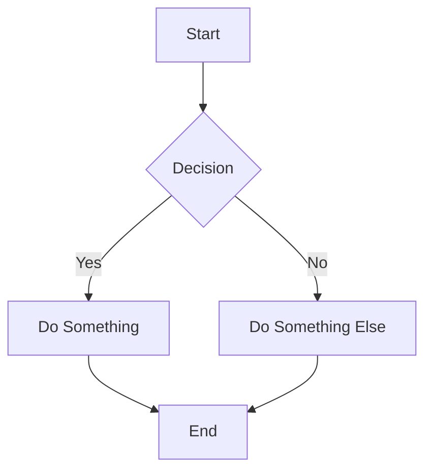
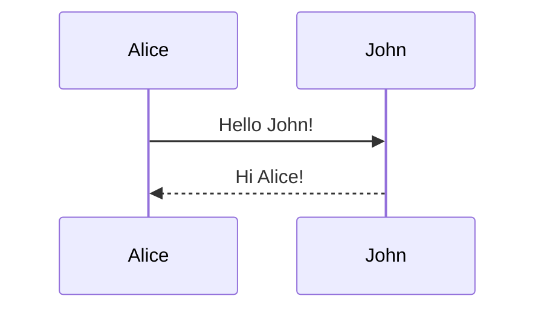
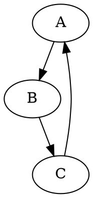
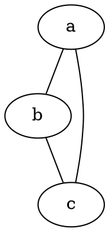

Based on the research, here's a comprehensive implementation plan for adding diagram support to your markdown-to-PDF static web app:[1][2][3][4]

***

# Implementation Plan: Diagram Support for Markdown-to-PDF

## Libraries Overview

You'll be adding support for **four client-side diagram libraries**:

### 1. **Mermaid.js** - Flowcharts, sequence diagrams, Gantt charts
- **CDN**: `https://cdn.jsdelivr.net/npm/mermaid@latest/dist/mermaid.esm.min.mjs`
- **API**: `mermaid.initialize()`, `mermaid.render(id, code)` 
- **Output**: SVG elements
- **Dependencies**: None (standalone)

### 2. **Viz.js** - Graphviz DOT language graphs
- **CDN**: `https://cdn.jsdelivr.net/npm/@viz-js/viz@latest/lib/viz-standalone.js`
- **API**: `Viz.instance()` returns promise, then `viz.renderSVGElement(dotCode)`
- **Output**: SVGSVGElement
- **Dependencies**: None (WebAssembly compiled)

### 3. **Nomnoml** - UML class diagrams
- **CDN**: 
  - `https://unpkg.com/graphre/dist/graphre.js` (dependency)
  - `https://unpkg.com/nomnoml/dist/nomnoml.js`
- **API**: `nomnoml.renderSvg(code)` returns SVG string
- **Output**: SVG string (needs parsing to element)
- **Dependencies**: graphre

### 4. **Pikchr** - PIC-like technical diagrams
- **Package**: `pikchr-js` (needs to be bundled or loaded via CDN if available)
- **API**: `pikchr(code)` returns `{svg: string, width: number, height: number}`
- **Output**: SVG string
- **Dependencies**: None (Emscripten compiled)

***

## Technical Details

### Markdown Code Block Detection

Fenced code blocks in markdown follow this pattern:[5]
```
```language-name
diagram code here
```
```

**Regex pattern** to detect code blocks:
```javascript
/```(\w+)\n([\s\S]*?)```/g
```

**Language identifiers to support**:
- `mermaid` - Mermaid.js
- `dot` or `graphviz` - Viz.js
- `nomnoml` - Nomnoml
- `pikchr` - Pikchr

### SVG Rendering with html2canvas

**Critical requirement**: html2canvas has limited SVG support. To ensure SVGs render correctly:[6][7][8]

1. **Use inline SVG elements** (not external files)[8]
2. **Apply all styles as inline attributes**, not CSS[7][6]
3. **Avoid transformations on SVG tags** - html2canvas reapplies them[6]
4. **Insert SVGs into DOM before calling html2canvas**[8]

### Library API Usage Patterns

**Mermaid.js**:[9][10][1]
```javascript
// Initialize (do once)
import mermaid from 'https://cdn.jsdelivr.net/npm/mermaid@latest/dist/mermaid.esm.min.mjs';
mermaid.initialize({ startOnLoad: false });

// Render diagram
const { svg } = await mermaid.render('unique-id', diagramCode);
element.innerHTML = svg; // svg is a string
```

**Viz.js**:[2][11]
```javascript
// Get instance (async, do once)
const viz = await Viz.instance();

// Render diagram
const svgElement = await viz.renderSVGElement(dotCode);
container.appendChild(svgElement); // Already an SVGSVGElement
```

**Nomnoml**:[3][4][12]
```javascript
// Load dependencies first: graphre, then nomnoml

// Render diagram
const svgString = nomnoml.renderSvg(nomnomlCode);
const parser = new DOMParser();
const svgDoc = parser.parseFromString(svgString, 'image/svg+xml');
const svgElement = svgDoc.documentElement;
container.appendChild(svgElement);
```

**Pikchr**:[13][14]
```javascript
// Assuming pikchr function is loaded globally

// Render diagram
const result = pikchr(pikchrCode);
const parser = new DOMParser();
const svgDoc = parser.parseFromString(result.svg, 'image/svg+xml');
const svgElement = svgDoc.documentElement;
container.appendChild(svgElement);
```

***

## TDD Implementation Steps

### Phase 1: Setup & Infrastructure

**Step 1.1: Add library loading system**
- **Test**: Create test that verifies libraries can be loaded dynamically
- **Implement**: Add script loader utility for CDN resources
- **Commit**: "Add dynamic script loader for diagram libraries"

**Step 1.2: Create diagram renderer interface**
- **Test**: Define expected interface (method signature returning SVG element)
- **Implement**: Create abstract renderer base class/interface
- **Commit**: "Add diagram renderer interface"

### Phase 2: Markdown Parser Enhancement

**Step 2.1: Code block detection**
- **Test**: Write tests for regex matching fenced code blocks with various languages
  - Test: Single code block
  - Test: Multiple code blocks
  - Test: Code blocks with no language
  - Test: Nested backticks in content
  - Test: Mixed diagram and regular code blocks
- **Implement**: Add function `extractCodeBlocks(markdown)` returning array of `{language, code, startIndex, endIndex}`
- **Commit**: "Add code block extraction from markdown"

**Step 2.2: Diagram block identification**
- **Test**: Filter code blocks to only diagram languages
- **Implement**: Add function `isDiagramLanguage(language)` and `getDiagramBlocks(markdown)`
- **Commit**: "Add diagram block identification"

### Phase 3: Individual Renderers (TDD for each)

**For each library (Mermaid, Viz, Nomnoml, Pikchr), follow this pattern:**

**Step 3.X.1: Renderer tests**
- **Test 1**: Library loads successfully
- **Test 2**: Simple valid diagram renders to SVG element
- **Test 3**: SVG element has proper attributes (width, height, viewBox)
- **Test 4**: Invalid diagram code throws/handles error gracefully
- **Test 5**: Multiple diagrams render independently

**Step 3.X.2: Implement renderer**
- Create class `MermaidRenderer extends DiagramRenderer`
- Implement `async initialize()` to load library
- Implement `async render(code)` returning SVG element
- Implement error handling
- **Commit**: "Add [LibraryName] renderer with tests"

**Step 3.X.3: Integration test**
- **Test**: Replace markdown code block with rendered diagram in DOM
- **Implement**: Function to replace code block with diagram container
- **Commit**: "Integrate [LibraryName] with markdown parser"

### Phase 4: Orchestration

**Step 4.1: Diagram manager**
- **Test**: Create tests for managing multiple diagram types
  - Test: Route 'mermaid' block to MermaidRenderer
  - Test: Route 'dot' block to VizRenderer
  - Test: Route 'nomnoml' block to NomnomlRenderer
  - Test: Route 'pikchr' block to PikchrRenderer
  - Test: Handle unknown diagram type gracefully
- **Implement**: DiagramManager class with renderer registry
- **Commit**: "Add diagram manager with renderer routing"

**Step 4.2: Markdown processing pipeline**
- **Test**: End-to-end test: markdown with diagrams → HTML with SVGs
  - Test: Single diagram type
  - Test: Multiple diagram types in same document
  - Test: Diagrams preserve order and position
  - Test: Non-diagram code blocks remain unchanged
- **Implement**: 
  - Parse markdown to HTML
  - Detect diagram blocks
  - Replace with placeholder elements
  - Render diagrams asynchronously
  - Insert SVGs into placeholders
- **Commit**: "Add complete markdown-to-HTML with diagrams pipeline"

**Step 4.3: html2canvas integration**
- **Test**: Verify SVG diagrams render in PDF output
  - Test: Simple mermaid diagram in PDF
  - Test: Multiple diagram types in PDF
  - Test: SVG styling is preserved
- **Implement**: 
  - Ensure SVGs have inline styles
  - Wait for all diagrams to render before calling html2canvas
  - Add error boundaries for rendering failures
- **Commit**: "Integrate diagram rendering with html2canvas PDF generation"

### Phase 5: Error Handling & UX

**Step 5.1: Error handling**
- **Test**: Display friendly error messages for:
  - Invalid diagram syntax
  - Library loading failures
  - Rendering timeouts
- **Implement**: Error handling wrapper for each renderer
- **Commit**: "Add comprehensive error handling for diagram rendering"

**Step 5.2: Loading states**
- **Test**: Show loading indicators while diagrams render
- **Implement**: Placeholder elements with loading state
- **Commit**: "Add loading indicators for diagram rendering"

### Phase 6: Documentation & Examples

**Step 6.1: Update README**
- Add section "Supported Diagram Languages"
- Document each language with syntax examples
- Add limitations and browser requirements
- **Commit**: "Document diagram language support"

**Step 6.2: Add examples**
- Create example markdown files for each diagram type:
  - `examples/mermaid-flowchart.md`
  - `examples/graphviz-graph.md`
  - `examples/nomnoml-uml.md`
  - `examples/pikchr-technical.md`
  - `examples/mixed-diagrams.md`
- **Commit**: "Add diagram examples"

**Step 6.3: Add syntax reference**
- Create quick reference for each language's syntax
- Link to official documentation
- **Commit**: "Add diagram syntax reference"

***

## Detailed Implementation Guide

### File Structure
```
/src
  /renderers
    DiagramRenderer.js          # Base interface
    MermaidRenderer.js
    VizRenderer.js
    NomnomlRenderer.js
    PikchrRenderer.js
  /utils
    scriptLoader.js             # Dynamic CDN script loading
    markdownParser.js           # Code block extraction
  DiagramManager.js             # Renderer orchestration
  MarkdownToPdf.js              # Main application (existing)
  
/tests
  /renderers
    MermaidRenderer.test.js
    VizRenderer.test.js
    NomnomlRenderer.test.js
    PikchrRenderer.test.js
  /utils
    markdownParser.test.js
  DiagramManager.test.js
  integration.test.js
  
/examples
  mermaid-flowchart.md
  graphviz-graph.md
  nomnoml-uml.md
  pikchr-technical.md
  mixed-diagrams.md
```

### Core Implementation Details

#### 1. Script Loader (`scriptLoader.js`)
```javascript
// Loads external scripts dynamically and caches them
class ScriptLoader {
  constructor() {
    this.loadedScripts = new Set();
  }
  
  async load(url) {
    if (this.loadedScripts.has(url)) {
      return Promise.resolve();
    }
    
    return new Promise((resolve, reject) => {
      const script = document.createElement('script');
      script.src = url;
      script.onload = () => {
        this.loadedScripts.add(url);
        resolve();
      };
      script.onerror = () => reject(new Error(`Failed to load ${url}`));
      document.head.appendChild(script);
    });
  }
  
  async loadModule(url) {
    if (this.loadedScripts.has(url)) {
      return Promise.resolve();
    }
    
    const module = await import(url);
    this.loadedScripts.add(url);
    return module;
  }
}
```

#### 2. Markdown Parser (`markdownParser.js`)
```javascript
// Extracts code blocks from markdown
function extractCodeBlocks(markdown) {
  const codeBlockRegex = /```(\w+)?\n([\s\S]*?)```/g;
  const blocks = [];
  let match;
  
  while ((match = codeBlockRegex.exec(markdown)) !== null) {
    blocks.push({
      language: match[1] || '',
      code: match[2].trim(),
      startIndex: match.index,
      endIndex: match.index + match[0].length,
      fullMatch: match[0]
    });
  }
  
  return blocks;
}

function isDiagramLanguage(language) {
  const diagramLanguages = ['mermaid', 'dot', 'graphviz', 'nomnoml', 'pikchr'];
  return diagramLanguages.includes(language.toLowerCase());
}

function getDiagramBlocks(markdown) {
  const allBlocks = extractCodeBlocks(markdown);
  return allBlocks.filter(block => isDiagramLanguage(block.language));
}
```

#### 3. Base Diagram Renderer (`DiagramRenderer.js`)
```javascript
class DiagramRenderer {
  constructor() {
    this.initialized = false;
  }
  
  // Must be implemented by subclasses
  async initialize() {
    throw new Error('initialize() must be implemented');
  }
  
  // Must be implemented by subclasses
  // Returns: Promise<SVGSVGElement>
  async render(code) {
    throw new Error('render() must be implemented');
  }
  
  // Helper: Convert SVG string to SVGElement
  svgStringToElement(svgString) {
    const parser = new DOMParser();
    const svgDoc = parser.parseFromString(svgString, 'image/svg+xml');
    return svgDoc.documentElement;
  }
  
  // Helper: Ensure SVG has inline styles for html2canvas
  ensureInlineStyles(svgElement) {
    // Copy computed styles to inline styles
    const allElements = svgElement.querySelectorAll('*');
    allElements.forEach(el => {
      const computed = window.getComputedStyle(el);
      // Only copy essential properties
      const props = ['fill', 'stroke', 'stroke-width', 'font-family', 'font-size'];
      props.forEach(prop => {
        const value = computed.getPropertyValue(prop);
        if (value) {
          el.style[prop] = value;
        }
      });
    });
    return svgElement;
  }
}
```

#### 4. Mermaid Renderer (`MermaidRenderer.js`)
```javascript
class MermaidRenderer extends DiagramRenderer {
  async initialize() {
    if (this.initialized) return;
    
    const loader = new ScriptLoader();
    const mermaidModule = await loader.loadModule(
      'https://cdn.jsdelivr.net/npm/mermaid@latest/dist/mermaid.esm.min.mjs'
    );
    
    this.mermaid = mermaidModule.default;
    this.mermaid.initialize({ 
      startOnLoad: false,
      theme: 'default'
    });
    
    this.initialized = true;
  }
  
  async render(code) {
    if (!this.initialized) {
      await this.initialize();
    }
    
    try {
      const id = `mermaid-${Date.now()}-${Math.random().toString(36).substr(2, 9)}`;
      const { svg } = await this.mermaid.render(id, code);
      
      const svgElement = this.svgStringToElement(svg);
      return this.ensureInlineStyles(svgElement);
    } catch (error) {
      throw new Error(`Mermaid rendering failed: ${error.message}`);
    }
  }
}
```

#### 5. Viz.js Renderer (`VizRenderer.js`)
```javascript
class VizRenderer extends DiagramRenderer {
  async initialize() {
    if (this.initialized) return;
    
    const loader = new ScriptLoader();
    await loader.load('https://cdn.jsdelivr.net/npm/@viz-js/viz@latest/lib/viz-standalone.js');
    
    // Viz is now available globally
    this.viz = await Viz.instance();
    this.initialized = true;
  }
  
  async render(code) {
    if (!this.initialized) {
      await this.initialize();
    }
    
    try {
      const svgElement = await this.viz.renderSVGElement(code);
      return this.ensureInlineStyles(svgElement);
    } catch (error) {
      throw new Error(`Graphviz rendering failed: ${error.message}`);
    }
  }
}
```

#### 6. Nomnoml Renderer (`NomnomlRenderer.js`)
```javascript
class NomnomlRenderer extends DiagramRenderer {
  async initialize() {
    if (this.initialized) return;
    
    const loader = new ScriptLoader();
    // Load dependency first
    await loader.load('https://unpkg.com/graphre/dist/graphre.js');
    // Then load nomnoml
    await loader.load('https://unpkg.com/nomnoml/dist/nomnoml.js');
    
    // nomnoml is now available globally
    this.initialized = true;
  }
  
  async render(code) {
    if (!this.initialized) {
      await this.initialize();
    }
    
    try {
      const svgString = nomnoml.renderSvg(code);
      const svgElement = this.svgStringToElement(svgString);
      return this.ensureInlineStyles(svgElement);
    } catch (error) {
      throw new Error(`Nomnoml rendering failed: ${error.message}`);
    }
  }
}
```

#### 7. Pikchr Renderer (`PikchrRenderer.js`)
```javascript
class PikchrRenderer extends DiagramRenderer {
  async initialize() {
    if (this.initialized) return;
    
    const loader = new ScriptLoader();
    // Load pikchr-js (may need to bundle this or find CDN)
    // Assuming it's bundled or available at a CDN
    await loader.load('https://unpkg.com/pikchr-js@latest/dist/pikchr.js');
    
    // pikchr is now available globally
    this.initialized = true;
  }
  
  async render(code) {
    if (!this.initialized) {
      await this.initialize();
    }
    
    try {
      const result = pikchr(code);
      if (result.error) {
        throw new Error(result.error);
      }
      
      const svgElement = this.svgStringToElement(result.svg);
      // Set dimensions from result
      svgElement.setAttribute('width', result.width);
      svgElement.setAttribute('height', result.height);
      
      return this.ensureInlineStyles(svgElement);
    } catch (error) {
      throw new Error(`Pikchr rendering failed: ${error.message}`);
    }
  }
}
```

#### 8. Diagram Manager (`DiagramManager.js`)
```javascript
class DiagramManager {
  constructor() {
    this.renderers = new Map();
    this.registerDefaultRenderers();
  }
  
  registerDefaultRenderers() {
    this.register('mermaid', new MermaidRenderer());
    this.register('dot', new VizRenderer());
    this.register('graphviz', new VizRenderer());
    this.register('nomnoml', new NomnomlRenderer());
    this.register('pikchr', new PikchrRenderer());
  }
  
  register(language, renderer) {
    this.renderers.set(language.toLowerCase(), renderer);
  }
  
  async renderDiagram(language, code) {
    const renderer = this.renderers.get(language.toLowerCase());
    
    if (!renderer) {
      throw new Error(`No renderer registered for language: ${language}`);
    }
    
    return await renderer.render(code);
  }
  
  supportsLanguage(language) {
    return this.renderers.has(language.toLowerCase());
  }
}
```

#### 9. Integration with Markdown-to-PDF (`MarkdownToPdf.js`)
```javascript
class MarkdownToPdf {
  constructor() {
    this.diagramManager = new DiagramManager();
  }
  
  async convertMarkdownToHtml(markdown) {
    // 1. Convert markdown to HTML (existing functionality)
    let html = this.markdownToHtml(markdown);
    
    // 2. Create container
    const container = document.createElement('div');
    container.innerHTML = html;
    
    // 3. Find and replace diagram code blocks
    const diagramBlocks = getDiagramBlocks(markdown);
    
    for (const block of diagramBlocks) {
      try {
        // Create placeholder with unique ID
        const placeholderId = `diagram-${Date.now()}-${Math.random().toString(36).substr(2, 9)}`;
        const placeholder = document.createElement('div');
        placeholder.id = placeholderId;
        placeholder.className = 'diagram-container';
        
        // Replace code block in HTML
        // (You'll need to find the corresponding <pre><code> element)
        
        // Render diagram
        const svgElement = await this.diagramManager.renderDiagram(
          block.language,
          block.code
        );
        
        // Insert SVG
        placeholder.appendChild(svgElement);
        
      } catch (error) {
        console.error(`Failed to render ${block.language} diagram:`, error);
        // Show error in place of diagram
        const errorDiv = document.createElement('div');
        errorDiv.className = 'diagram-error';
        errorDiv.textContent = `Error rendering ${block.language}: ${error.message}`;
        placeholder.appendChild(errorDiv);
      }
    }
    
    return container.innerHTML;
  }
  
  async generatePdf(markdown) {
    // 1. Convert markdown with diagrams
    const html = await this.convertMarkdownToHtml(markdown);
    
    // 2. Create temporary container
    const container = document.createElement('div');
    container.innerHTML = html;
    document.body.appendChild(container);
    
    // 3. Wait for all SVGs to be fully rendered
    await this.waitForDiagrams(container);
    
    // 4. Use html2canvas to generate PDF
    const canvas = await html2canvas(container);
    
    // 5. Convert canvas to PDF (existing functionality)
    const pdf = this.canvasToPdf(canvas);
    
    // 6. Cleanup
    document.body.removeChild(container);
    
    return pdf;
  }
  
  async waitForDiagrams(container) {
    const diagrams = container.querySelectorAll('.diagram-container svg');
    // Simple wait for SVG elements to be in DOM
    return new Promise(resolve => {
      if (diagrams.length === 0) {
        resolve();
        return;
      }
      
      // Wait a frame for SVGs to fully render
      requestAnimationFrame(() => {
        requestAnimationFrame(resolve);
      });
    });
  }
}
```

***

## Testing Strategy

### Unit Tests (for each renderer)
```javascript
// Example: MermaidRenderer.test.js
describe('MermaidRenderer', () => {
  let renderer;
  
  beforeEach(() => {
    renderer = new MermaidRenderer();
  });
  
  test('initializes successfully', async () => {
    await renderer.initialize();
    expect(renderer.initialized).toBe(true);
  });
  
  test('renders simple flowchart', async () => {
    const code = 'graph TD\nA-->B';
    const svg = await renderer.render(code);
    
    expect(svg.tagName).toBe('svg');
    expect(svg.querySelector('g')).toBeTruthy();
  });
  
  test('throws error on invalid syntax', async () => {
    const code = 'invalid mermaid syntax @#$';
    await expect(renderer.render(code)).rejects.toThrow();
  });
  
  test('applies inline styles', async () => {
    const code = 'graph TD\nA-->B';
    const svg = await renderer.render(code);
    
    // Check that elements have inline styles
    const elements = svg.querySelectorAll('[fill], [stroke]');
    expect(elements.length).toBeGreaterThan(0);
  });
});
```

### Integration Tests
```javascript
describe('Markdown to PDF with Diagrams', () => {
  test('converts mermaid diagram to PDF', async () => {
    const markdown = `
# Test Document

\`\`\`mermaid
graph TD
A-->B
\`\`\`
    `;
    
    const converter = new MarkdownToPdf();
    const html = await converter.convertMarkdownToHtml(markdown);
    
    expect(html).toContain('<svg');
    expect(html).not.toContain('```mermaid');
  });
  
  test('handles multiple diagram types', async () => {
    const markdown = `
\`\`\`mermaid
graph TD
A-->B
\`\`\`

\`\`\`nomnoml
[A]->[B]
\`\`\`
    `;
    
    const converter = new MarkdownToPdf();
    const html = await converter.convertMarkdownToHtml(markdown);
    
    const svgCount = (html.match(/<svg/g) || []).length;
    expect(svgCount).toBe(2);
  });
});
```

***

## Example Syntax for Documentation

### Mermaid.js Examples [][]
````markdown



````

### Graphviz (DOT) Examples []
````markdown



````

### Nomnoml Examples []
````markdown
```nomnoml
[Customer]->[Order]
[Order]->[Product]
```

```nomnoml
[<frame>Architecture|
  [Frontend]-->[Backend]
  [Backend]-->[Database]
]
```
````

### Pikchr Examples []
````markdown
```pikchr
box "Server"; arrow; box "Client"
```

```pikchr
circle "Start"; arrow; box "Process"; arrow; circle "End"
```
````

***

## Commit Strategy

Follow this pattern for small, regular commits:

1. `git commit -m "Add ScriptLoader utility"`
2. `git commit -m "Add markdown code block extraction"`
3. `git commit -m "Add DiagramRenderer base class"`
4. `git commit -m "Add MermaidRenderer with tests"`
5. `git commit -m "Add VizRenderer with tests"`
6. `git commit -m "Add NomnomlRenderer with tests"`
7. `git commit -m "Add PikchrRenderer with tests"`
8. `git commit -m "Add DiagramManager"`
9. `git commit -m "Integrate diagram rendering with markdown parser"`
10. `git commit -m "Add html2canvas compatibility layer"`
11. `git commit -m "Add error handling for diagram rendering"`
12. `git commit -m "Add loading states for diagrams"`
13. `git commit -m "Update README with diagram support"`
14. `git commit -m "Add diagram examples"`
15. `git commit -m "Add syntax reference documentation"`

***

## Important Gotchas for AI Assistant

1. **Async/Await**: All rendering is asynchronous - ensure promises are properly awaited
2. **SVG Inline Styles**: html2canvas requires inline styles, not CSS classes [][]
3. **Library Loading Order**: Nomnoml requires graphre to be loaded first [page:1]
4. **Unique IDs**: Mermaid requires unique IDs for each render call []
5. **Error Boundaries**: Always wrap rendering in try-catch to handle invalid syntax gracefully
6. **DOM Insertion**: SVGs must be in DOM before html2canvas captures them []
7. **Script Loading**: Use dynamic imports or script tags, libraries must be loaded before use
8. **CDN Availability**: Test that CDN URLs are accessible and use fallbacks if needed

***

This plan should provide the AI assistant with everything needed to implement diagram support following TDD principles while keeping the app entirely client-side [][][].

Sources
[1] Usage - Mermaid Chart https://mermaid.ai/open-source/config/usage.html
[2] API - Viz.js https://viz-js.com/api/
[3] skanaar/nomnoml: The sassy UML diagram renderer - GitHub https://github.com/skanaar/nomnoml
[4] Markdown to PDF Converter v2 - Chris Barlow https://cgee.nz/files/md2pdf.html
[5] How can I match a Markdown code block with RegEx? https://stackoverflow.com/questions/41351903/how-can-i-match-a-markdown-code-block-with-regex
[6] html2canvas and inline SVG - javascript - Stack Overflow https://stackoverflow.com/questions/49690830/html2canvas-and-inline-svg
[7] Cannot draw SVG on the html canvas · Issue #1543 - GitHub https://github.com/niklasvh/html2canvas/issues/1543
[8] SVG not displayed when using html2canvas - Stack Overflow https://stackoverflow.com/questions/32481054/svg-not-displayed-when-using-html2canvas
[9] mermaidAPI.md - GitHub https://github.com/mermaidjs/mermaidjs.github.io/blob/master/docs/mermaidAPI.md
[10] A Mermaid User-Guide for Beginners - GitHub Pages https://emersonbottero.github.io/mermaid-docs/intro/n00b-gettingStarted.html
[11] API (2.x) · mdaines/viz-js Wiki - GitHub https://github.com/mdaines/viz-js/wiki/API-(2.x)
[12] nomnoml - JavaScript on Fiber - FIBJS https://fibjs.org/docs/awesome/module/nomnoml.md.html
[13] abetlen/pikchr-js - GitHub https://github.com/abetlen/pikchr-js
[14] Converting Markdown with Mermaid diagrams to PDF - Stack Overflow https://stackoverflow.com/questions/78897186/converting-markdown-with-mermaid-diagrams-to-pdf-graphs-missing-in-pdf-output
[15] How to render a mermaid flowchart dynamically? - Stack Overflow https://stackoverflow.com/questions/65212332/how-to-render-a-mermaid-flowchart-dynamically
[16] Diagram Syntax - Mermaid https://mermaid.js.org/intro/syntax-reference.html
[17] Rendering Mermaid Charts - Markdown Monster https://markdownmonster.west-wind.com/docs/Markdown-Rendering-Extensions/Rendering-Mermaid-Charts.html
[18] Pikchr: Documentation https://pikchr.org
[19] Pikchr Examples https://pikchr.org/home/doc/trunk/doc/examples.md
[20] Pikchr Command-Line Tool | pikchr-cmd - GitHub Pages https://zenomt.github.io/pikchr-cmd/
[21] All Help Text - Pikchr https://pikchr.org/home/test-all-help
[22] In Praise of Pic (and pikchr) - Philipp K. Janert, Ph.D. https://janert.me/guides/praise-of-pic/
[23] Creating a regex-based Markdown parser in TypeScript https://yongliangliu.com/blog/rmark

